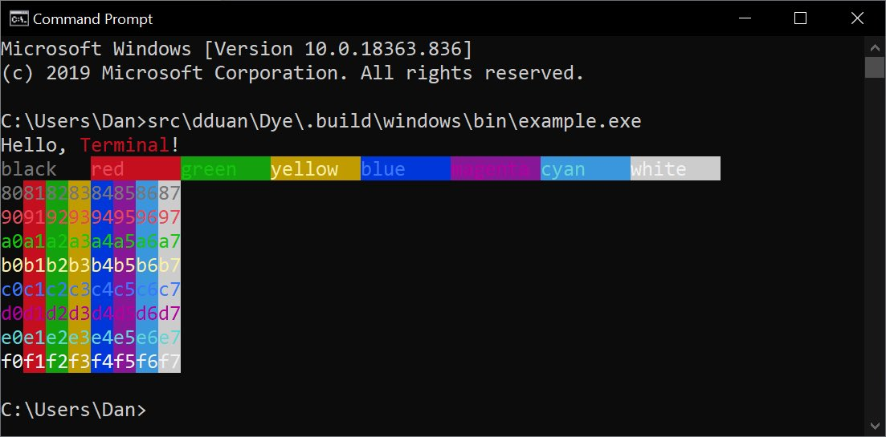

# Dye

Dye is a Swift library for adding styles and colors to command-line outputs.

It works in terminal simulator that supports ANSI (most on macOS and Linux), as
well as older apps on Windows, such as CMD.exe.

## Usage

### SwiftPM/Xcode

Dye is a SwiftPM package. Add it as a dependency in Package.swift:

```swift
.package(url: "http://github.com/dduan/Pathos", from: "0.0.1")
```

… or the URL in Xcode.

### CMake

Dye also builds with CMake. It works on Windows 10 and Swift 5.2.

## Documentation

The file [Examples/main.swift](Examples/main.swift) is a sample application that
demonstrates most of Dye's APIs. To get a taste of how Dye works, try it out
with `swift run example`, and take a look at its source code.

This is what the example CLI app looks like in Command Prompt on Windows:



Read the docstring in the source code for detailed API documentation.

Dye follows the [NO_COLOR convention](https://no-color.org).

## License

MIT. See LICENSE.md

## Alternative

If you don't need Windows Support, I recommend you check out [Chalk](https://github.com/mxcl/Chalk).
